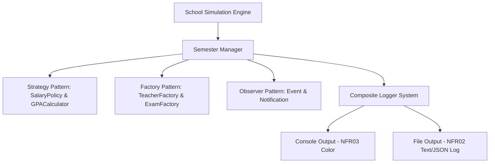

Viewed REQUIREMENT.md:1-594
Listed directory School_CRUD_console
Listed directory Interfaces
Listed directory Model
Listed directory Services
Viewed Program.cs:1-11
Viewed CONST.cs:1-15
Viewed ENUM.cs:1-10
Viewed IPersonService.cs:1-11
Viewed PersonService.cs:1-68
Viewed Person.cs:1-53
Viewed Employee.cs:1-29
Viewed Teacher.cs:1-76
Viewed Student.cs:1-74
Viewed Exam.cs:1-40
Viewed ExamResult.cs:1-20
Viewed Subjects.cs:1-78
Viewed School.cs:1-6
Viewed Study.md:1-113

Dưới đây là phân tích chi tiết dự án [School_CRUD_console](file:///home/van/dev/DotNet/School_CRUD_console) và so sánh trực tiếp với yêu cầu trong [REQUIREMENT.md](file:///home/van/dev/DotNet/REQUIREMENT.md).

---

## 1. Những phần BẠN ĐÃ LÀM THÊM (Mở rộng ngoài Requirement v1)

| Thành phần đã làm thêm | Chi tiết trong code | Đánh giá & Mục đích |
| :--- | :--- | :--- |
| **Lớp `Employee`** | Lớp [Employee.cs](file:///home/van/dev/DotNet/School_CRUD_console/Model/Employee.cs#L2-L29) kế thừa từ `Person` có thêm `Department`, `Salary`, `GetIncome()`. | Requirement v1 chỉ yêu cầu `Teacher` và `Student` thuộc `Person`. Lớp `Employee` giúp bạn thực hành đa hình tốt hơn. |
| **Dịch vụ CRUD `PersonService`** | [IPersonService.cs](file:///home/van/dev/DotNet/School_CRUD_console/Interfaces/IPersonService.cs) & [PersonService.cs](file:///home/van/dev/DotNet/School_CRUD_console/Services/PersonService.cs) quản lý danh sách `Person` tổng quát (`Add`, `Remove`, `FindByName`, `FindByID`, `DisplayAll`). | Giúp quản lý danh sách `Person` tập trung, phù hợp với các ứng dụng CRUD cơ bản. |
| **Mở rộng `Subject` Enum & `EnumHelper`** | [Subjects.cs](file:///home/van/dev/DotNet/School_CRUD_console/Model/Subjects.cs#L25-L71) dùng `DescriptionAttribute`, hàm `ParseFromDescription`, và Extension method `GetDescription()`. | Đã thêm các môn `Biology`, `Literature`, `Geography`. Viết `EnumHelper` bằng Reflection rất chuyên nghiệp để hiển thị chuẩn tên môn học. |
| **Tách file hằng số `CONST.cs`** | [CONST.cs](file:///home/van/dev/DotNet/School_CRUD_console/CONST.cs#L3-L14) chứa `LOW_EASY_DIFF`, `HIGH_EASY_DIFF`, `GRAND`, `MIL`,... | Giúp quản lý Magic Numbers tập trung, code sạch và dễ điều chỉnh tham số mô phỏng. |
| **File ghi chú học tập `Study.md`** | [Study.md](file:///home/van/dev/DotNet/School_CRUD_console/Study.md) ghi chép về `Null handling`, `Primary Constructor`, `Pattern Matching`, `LINQ`. | Rất tốt cho việc hệ thống hóa kiến thức C# / .NET. |

---

## 2. Những điểm CÒN THIẾU SÓT (So với REQUIREMENT.md)

### A. Functional Requirements (Tính năng nghiệp vụ)
1. **Chưa có luồng mô phỏng Học kỳ (FR09 - Simulation Engine & Lớp `School`):**
   - File [School.cs](file:///home/van/dev/DotNet/School_CRUD_console/Model/School.cs) đang hoàn toàn **rỗng**.
   - [Program.cs](file:///home/van/dev/DotNet/School_CRUD_console/Program.cs) chưa có code chạy chính (Main entry point).
   - Chưa triển khai quy trình chạy tự động theo Semester: `Teaching` $\rightarrow$ `Create Exam` $\rightarrow$ `Take Exam` $\rightarrow$ `Calculate GPA` $\rightarrow$ `Evaluate Teacher` $\rightarrow$ `Report`.
2. **Logic nghiệp vụ của Giáo viên chưa hoàn thiện (FR01, FR07, FR08):**
   - Các phương thức trong [Teacher.cs](file:///home/van/dev/DotNet/School_CRUD_console/Model/Teacher.cs#L56-L71) (`CreateExam()`, `Teach()`, `EvaluateStudents()`) hiện tại đều là **hàm rỗng (stub)**.
   - **Chưa có Đánh giá giáo viên (FR07):** Chưa có logic tính `Average GPA` học sinh để cộng/trừ lương (`Salary += 500` hoặc `-= 1000`) và cho nghỉ việc khi `Salary < 5000`.
   - **Chưa có Tuyển giáo viên mới (FR08):** Chưa có cơ chế tự động tuyển giáo viên thay thế (`HireNewTeacher()`) khi có người nghỉ việc.
   - Thiếu `TeacherStatus` enum trong [ENUM.cs](file:///home/van/dev/DotNet/School_CRUD_console/ENUM.cs).
3. **Logic tính GPA chuẩn thang 4.0 (FR06):**
   - Trong [Student.cs](file:///home/van/dev/DotNet/School_CRUD_console/Model/Student.cs#L65-L73), `CalculateGPA()` đang tính trung bình cộng đơn thuần trên thang điểm 100 (`GPA = sum / count`).
   - Requirement FR06 yêu cầu quy đổi điểm số ra **thang điểm 4.0** (ví dụ: trung bình điểm 90 $\rightarrow$ GPA = 3.8).

### B. Non-Functional Requirements & Architecture (Kiến trúc & Log)
1. **Hệ thống Nhật ký (FR10, NFR02 - Logger System):**
   - Chưa có interface `ILogger` và các triển khai `ConsoleLogger`, `TextFileLogger`, `JsonLogger` hay `CompositeLogger`.
   - Code hiện tại đang dùng `Console.WriteLine` rải rác, chưa ghi log ra file trong thư mục `logs/YYYYMMDD.log`.
2. **Hiển thị màu Console (NFR03):**
   - Chưa có helper chuyển đổi màu sắc Console (`Green` cho thành công, `Yellow` cho cảnh báo, `Red` cho lỗi).
3. **Các Design Patterns theo đề xuất (V3 Roadmap):**
   - **Repository Pattern:** Chưa tách `StudentRepository`, `TeacherRepository` (hiện tại gom chung vào `PersonService`).
   - **Strategy Pattern:** Chưa tách `ISalaryPolicy` và `IGPACalculator` thành các interface độc lập.
   - **Factory Pattern:** Chưa có `TeacherFactory`, `ExamFactory` để đóng gói logic sinh ngẫu nhiên dữ liệu.
   - **Notification / Event System:** Chưa có `INotificationChannel` để phát sự kiện khi thi xong hoặc giáo viên nghỉ việc.

---

## 3. Giải thích: Những thiếu sót đó GIẢI QUYẾT VẤN ĐỀ GÌ?

Mỗi phần thiếu sót nêu trên không chỉ là "thiếu tính năng", mà trong thiết kế phần mềm thực tế, chúng giải quyết các bài toán kiến trúc cốt lõi sau:

### 1. Thiếu Lớp `School` & `Semester` (Simulation Engine)
* **Vấn đề giải quyết:** Bài toán yêu cầu đây là một ứng dụng **Mô phỏng (Simulator)** tự động. Nếu không có `School` và `Semester`, dự án chỉ stop lại ở mức ứng dụng CRUD tĩnh (thêm/xóa/sửa bằng tay).
* **Tác dụng:** Lớp `School` và `Semester` đóng vai trò là **Orchestrator (Bộ điều phối)**, chịu trách nhiệm kích hoạt vòng đời mô phỏng theo từng học kỳ: bắt buộc giáo viên tạo đề $\rightarrow$ phân phối đề cho học sinh $\rightarrow$ chấm điểm $\rightarrow$ cập nhật GPA $\rightarrow$ đánh giá lương giáo viên $\rightarrow$ sa thải/tuyển mới.

### 2. Thiếu `ILogger` / `CompositeLogger` (Ghi log đa đầu ra & NFR02/NFR03)
* **Vấn đề giải quyết:** Hiện tại code đang `Console.WriteLine` trực tiếp ở khắp nơi (tạo ra sự **Tight Coupling - Phụ thuộc chặt** vào màn hình Console). Nếu tương lai muốn lưu log ra file TXT, file JSON, hoặc đẩy lên server, bạn sẽ phải vào từng file `Student.cs`, `PersonService.cs` để sửa.
* **Tác dụng (Nguyên lý SOLID - SRP & OCP):**
  - **Single Responsibility (SRP):** Các lớp Business Model (`Student`, `Teacher`) chỉ lo logic nghiệp vụ, không lo việc in/ghi log.
  - **Open/Closed (OCP) & Composite Pattern:** Khi dùng `CompositeLogger`, bạn có thể đồng thời in màu ra Console (NFR03) và ghi file `logs/20260801.log` (NFR02). Nếu sau này cần thêm `JsonLogger`, chỉ cần thêm 1 class mới mà **không sửa một dòng code nghiệp vụ nào**.

### 3. Thiếu `IGPACalculator` & `ISalaryPolicy` (Strategy Pattern)
* **Vấn đề giải quyết:** Công thức tính GPA hoặc chính sách khen thưởng/xử phạt lương giáo viên có thể thay đổi theo thời gian (ví dụ: trường thay đổi cách quy đổi điểm 100 $\rightarrow$ GPA 4.0, hoặc tăng mức phạt khi GPA < 2.5).
* **Tác dụng:** Tách logic tính toán ra khỏi `Student` và `Teacher` bằng **Strategy Pattern**. Lớp `Student` chỉ cần gọi `_gpaCalculator.Calculate(ExamResults)`, giúp dễ dàng thay đổi thuật toán tính GPA hoặc thuật toán tính lương mà không làm biến đổi cấu trúc của `Student` / `Teacher`.

### 4. Thiếu `TeacherFactory` & `ExamFactory` (Factory Method Pattern)
* **Vấn đề giải quyết:** Việc tạo một Giáo viên mới (khi tuyển dụng ở FR08) hoặc tạo một Đề thi (FR04) đòi hỏi ngẫu nhiên hóa các tham số (Tên, Tuổi, Độ khó, Số lượng câu hỏi, Môn học). Nếu viết logic random này trực tiếp trong `Program.cs` hoặc `Teacher.cs`, code sẽ bị phân tán và lặp lại.
* **Tác dụng:** **Factory Pattern** đóng gói toàn bộ logic tạo đối tượng ngẫu nhiên vào một nơi duy nhất (`ExamFactory.CreateExam(subject)`), giúp code sạch sẽ, dễ bảo trì và dễ unit test.

### 5. Thiếu `StudentRepository` / `TeacherRepository` (Repository Pattern)
* **Vấn đề giải quyết:** `PersonService` hiện tại gom chung cả `Student`, `Teacher`, `Employee` vào cùng một `List<Person>`. Việc này khiến việc tìm kiếm học sinh xuất sắc hay lọc giáo viên có nguy cơ nghỉ việc phải dùng ép kiểu hoặc lọc thủ công phức tạp.
* **Tác dụng:** Repository tách biệt việc lưu trữ dữ liệu theo từng Entity (`StudentRepository`, `TeacherRepository`), giúp code theo chuẩn kiến trúc thực tế, sẵn sàng cho bước khôi phục dữ liệu từ JSON/CSV (v4) hoặc kết nối Database trong ASP.NET Core (v6).

---

## 4. Gợi ý các bước hoàn thiện tiếp theo (Action Items)

1. **Bước 1:** Đóng gói hệ thống Log: Tạo `ILogger`, `ConsoleLogger` (có màu - NFR03), `TextFileLogger` (ghi file - NFR02) và `CompositeLogger`.
2. **Bước 2:** Đơn giản hóa & chuẩn hóa Model:
   - Viết logic cho `Teacher.CreateExam()`, `Teacher.EvaluateStudents()`.
   - Cập nhật `Student.CalculateGPA()` chuyển sang thang điểm 4.0.
3. **Bước 3:** Tạo `ExamFactory` và `TeacherFactory` để phục vụ việc tự động sinh dữ liệu mô phỏng.
4. **Bước 4:** Xây dựng lớp `Semester` & `School` để chạy mô phỏng hoàn chỉnh trong [Program.cs](file:///home/van/dev/DotNet/School_CRUD_console/Program.cs).